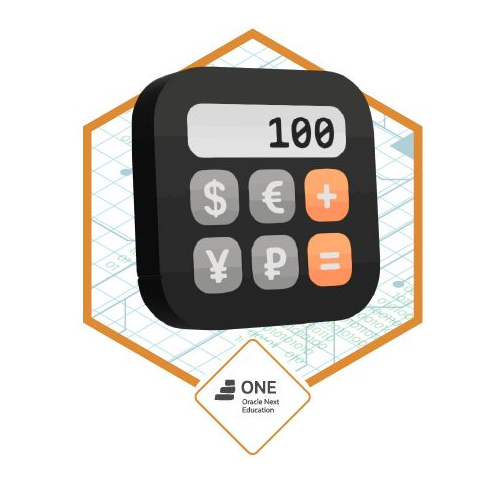

<h1 align="center"> RETO ALURAGEEK PROGRAMA ONE - ALURA </h1>

# Challenge  | Front End G6 - ONE 

🥇 Desarrollo del reto: "AluraGeek" 👩‍💻 💻  #challengeonecodificador6

Tercer reto del programa **Oracle ONE**

Creaciòn de interfaces funcionales y resoluciòn de problemas con HTML, CSS y JavaScript

     

### ¡Bienvenido al Alura Geek!

---

**Como se usa este Alura Geek?:** 
1. Descarga este archivo en tu PC, visualiza el archivo con extension html en tu navegador.
2. En la pagina veras un cuadro para agregar un prodcuto / Nombre / Precio / Imagen 
3. Luego le das click en enviar y tu producto se agrego satisfactoriamente.

     

 
  ❤️ ESTADO: Finalizado
 

## 🔎 Deploy

  <h3>
    <a href="https://bety2022.github.io/Encriptador/" >
      🔗 Visitar Alura Geek
    </a>

 

## 🛠️ Herramientas implementadas 
  - NodeJS
  - JSON-server
  - API
  - DOM
  - Layouts
  - Flexbox
  - CSS
  - HTML
  - JavaScript
  - Git || GitHub || GitHub Pages
  - Figma

    

 

 

## 📧 Contacto
¿Tienes un proyecto en mente? Conectémonos y hagamos que las cosas sucedan! Puedes escribirme a carolinalopezdatascientist@gmail.com o seguirme en [LinkedIn](https://www.linkedin.com/in/carolina-lopez-430208106/).
  
